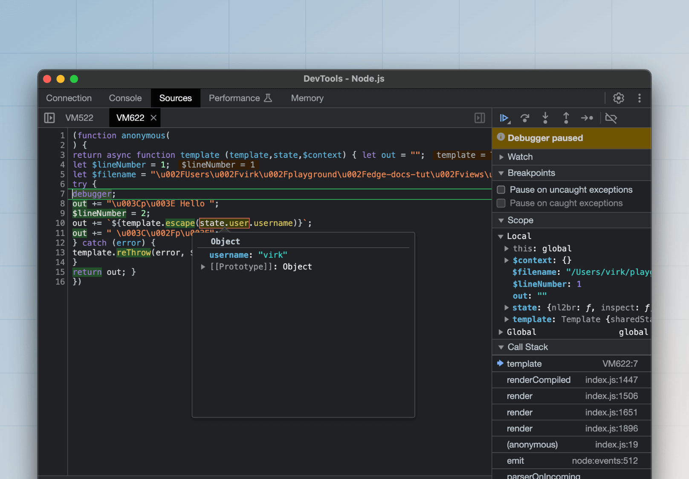

# Debugging

You can debug a template's values or state using one of the following approaches. 

## Using the inspect helper

You may use the `inspect` helper to prettyprint a value alongside the rest of the markup. The inspect helper returns HTML, which you must view in a browser for better readability.

```edge
{{
  inspect({
    a: 1,
    b: [3, 4, undefined, null],
    c: undefined,
    d: null,
    e: {
      regex: /^x/i,
      buf: Buffer.from('abc'),
    },
    balance: BigInt(100),
    id: Symbol('1234'),
    scores: new Set([1, 2, 3]),
    classes: new Map([['english', '1st'], ['maths', '2nd']]),
    currentScores: new WeakSet([[1, 2, 3]]),
    currentClasses: new WeakMap([[['english', '1st'], ['maths', '2nd']]]),
    now: new Date()
  })
}}
```

Output


## Using the debugger tag

The `debugger` tag writes a JavaScript [debugger](https://developer.mozilla.org/en-US/docs/Web/JavaScript/Reference/Statements/debugger) statement to the compiled output. You can run the Node.js server with the `--inspect` flag and use the Chrome devtools to open a debugging session.

```edge
@debugger
<p> Hello {{ user.username }} </p>
```

```sh
node --inspect index.js
```


