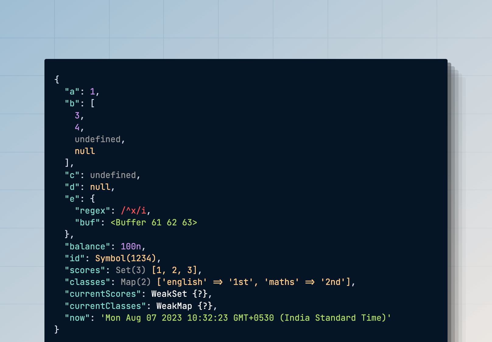

# Helpers
Following is the list of globally available helpers within Edge templates.

## html.classNames

The `html.classNames` helper method is used to serialize an array of classes to a string. The array can contain either strings or objects with conditional classes. For example:

```edge
<input class="{{
  html.classNames([
    'input',
    {
      'input-error': false,
      'input-disabled': true,
      'input-large': size === 'large',
      'input-medium': size === 'medium',
      'input-rounded': true
    },
  ])
}}" />
```

Given the value of `size` is `medium` following will be the output HTML.

```html
<input class="input input-disabled input-medium input-rounded" />
```

## html.attrs

The `html.attrs` helper converts an object to HTML attributes. For example:

```edge
<input {{
  html.attrs({
    id: 'name',
    placeholder: 'Enter your name',
    value: user.name
  })
}} />
```

Given the value of `user.name` is `null`, following will be the output HTML.

```html
<input id="name" placeholder="Enter your name" />
```

The value of the attributes object must be a **string**, **boolean**, or an **array of strings**. If the value is `undefined`, `null` or `false`, the attribute will be removed from the output.

| Value | Serialized output |
|------------|--------------------|
| `string` | Serialized as it is in the output |
| `string[]` | Array values can be concatenated either with a `comma`, or the `space` character depending upon the attribute. |
| `false` | Attribute will be removed from the serialized output. The same behavior is applied for `null` and `undefined` values. |
| `true` | Dependending upon the attribute, either the value will be serialized to a string or just the attribute will be defined |

### Serializing the class attribute

The `html.attrs` method gives special attention to the `class` attribute. The value of the `class` property can be a string, an array of strings or an object.

Under the hood, the [html.classNames](#htmlclassnames) method is used to serialize the `class` attributes.

```edge
<input {{
  html.attrs({
    class: [
      'input',
      'input-large',
      {
        'input-error': hasError,
      },
    ]
  })
}} />
```

Output

```html
<!-- hasError = false -->
<input class="input input-large" />

<!-- hasError = true -->
<input class="input input-large input-error" />
```

## nl2br

Converts new lines to HTML `<br />` tags. Since, the `nl2br` helper returns an HTML string (with break tags), you must use three curly braces to render the HTML as it is.

```edge
{{{ nl2br(post.content) }}}
```

If you want to escape the contents given to the `nl2br` method, you can wrap that inside the `html.escape` method.

In the following example, the `<br />` tags will be not be escaped, however, the `post.content` will be escaped.

```edge
{{{
  nl2br(
    html.escape(post.content)
  )
}}}
```

## html.escape
Escape HTML inside a string value. The double curly braces already escape the value, so use this method only when you are not using the three curly braces.

```edge
{{{ html.escape(post.content) }}}
```

## truncate
Truncate a string value to a given number of characters. For example:

```edge
{{
  truncate(
    'This is a very long sentence that i would like to be shortened',
    18
  )
}}

<!-- Output: This is a very long... -->
```

The `truncate` method doesn't chop the words in between and let them get completed. However, you can turn off this behavior by disabling the `completeWords` option.

```edge
{{
  truncate(
    'This is a very long sentence that i would like to be shortened',
    18,
    { completeWords: false }
  )
}}

<!-- Output: This is a very lon... -->
```

Also, you can define a custom suffix for the truncated string.

```edge
{{
  truncate(
    'This is a very long sentence that i would like to be shortened',
    18,
    { suffix: ' [Read more]' }
  )
}}

<!-- Output: This is a very long [Read more] -->
```

## excerpt
The `excerpt` method is similar to the `truncate` method. However, this method first removes the HTML tags, truncates the string and returns back plain text. Therefore, it is more suitable, if you want to generate an excerpt from HTML contents.

```edge
{{
  excerpt(
    '<p> Hello, this is a dummy <strong> post </strong> </p>',
    20
  )
}}

<!-- Output: Hello, this is a dummy... -->
```

You can disable `completeWords` option to perform strict truncation.

```edge
{{
  excerpt(
    '<p> Hello, this is a dummy <strong> post </strong> </p>',
    20,
    { completeWords: false }
  )
}}

<!-- Output: Hello, this is a du... -->
```

Finally, you also provide a `suffix` to use.

```edge
{{
  excerpt(
    '<p> Hello, this is a dummy <strong> post </strong> </p>',
    20,
    { suffix: ' [Read more]' }
  )
}}

<!-- Output: Hello, this is a dummy [Read more] -->
```

## inspect
You can use the `inspect` method to pretty print a value for debugging. The inspect helper returns HTML, which you must view in a browser for better readability.

```edge
{{
  inspect({
    a: 1,
    b: [3, 4, undefined, null],
    c: undefined,
    d: null,
    e: {
      regex: /^x/i,
      buf: Buffer.from('abc'),
    },
    balance: BigInt(100),
    id: Symbol('1234'),
    scores: new Set([1, 2, 3]),
    classes: new Map([['english', '1st'], ['maths', '2nd']]),
    currentScores: new WeakSet([[1, 2, 3]]),
    currentClasses: new WeakMap([[['english', '1st'], ['maths', '2nd']]]),
    now: new Date()
  })
}}
```

Output



## Changing case

You can use one of the following methods to transform a string case.

```edge
{{ camelCase('hello-world') }}
{{ snakeCase('hello-world') }}
{{ dashCase('HelloWorld') }}
{{ pascalCase('hello-world') }}
{{ capitalCase('hello-world') }}
{{ sentenceCase('hello-world') }}
{{ dotCase('hello-world') }}
{{ noCase('hello-world') }}
{{ titleCase('hello-world') }}
```
